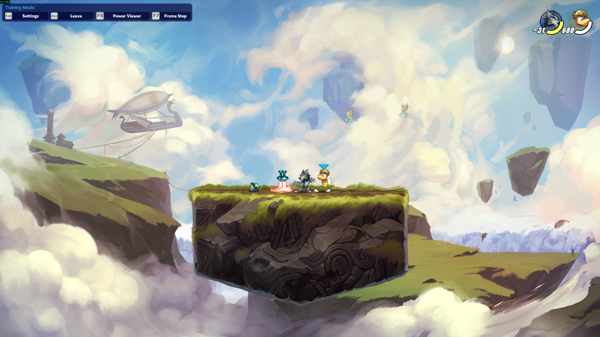
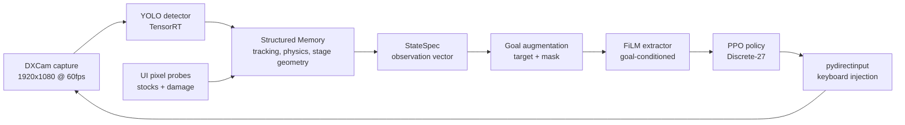

# Brawlhalla RL — Vision-Only Reinforcement Learning on a Commercial Fighting Game

Training a Brawlhalla agent from **screen pixels alone** — no memory reading, no game API, no
emulator — on a single consumer laptop (RTX 3050 Ti, 4 GB VRAM).

> **Status: active research.** The perception → state → control stack runs end to end against the
> live game. The low-level controller (LLC) curriculum is under active development and has not yet
> cleared its retention gates. Numbers in `outputs/` are development logs, not published results.
> Known open problems are listed in [Known Issues](#known-issues) — they are documented on purpose.



---

## Why this is hard

Most game-RL work runs in emulators or engines that can be reset, parallelised, and stepped faster
than real time. None of that is available here:

| Constraint | Consequence |
|---|---|
| No memory access | Every state variable must be recovered from pixels |
| No emulator / no pause | The environment runs in wall-clock real time and cannot be stepped |
| Cannot reset the match | Episode boundaries are logical, not physical — the world keeps going |
| Single environment | No parallelism; **27.5 control steps/second measured**, detector-bound |
| 4 GB VRAM | Detector and policy must share one small GPU |

That ceiling is the central design constraint of the project: **27.5 steps/s ≈ 2.4 M environment
steps per day of continuous play.** Every architectural decision here exists to buy sample
efficiency, because wall-clock time cannot be bought.

Profiled on an RTX 3050 Ti, detection is **93%** of each step (33.7 ms of 36.4 ms) while all
the Python combined is under 1%. See [`docs/performance.md`](docs/performance.md).

---

## Pipeline



**Perception.** The detector locates the agent, opponents and ground weapons. Agent identity is
resolved causally from the blue self-indicator triangle rather than from legend appearance, so the
scheme stays valid across legends and as the opponent pool grows.

**State.** `Memory` turns detections into a structured game state: positions, velocities, bounding-box
extent, stage geometry, ledge distances, and relational features. Stocks and damage are read from
fixed UI pixel probes. The observation is horizontally canonicalised and carries a short history
window — see [`docs/observation-space.md`](docs/observation-space.md).

**Control.** A single goal-conditioned policy (UVFA with FiLM modulation) is trained across five
skill families rather than five separate networks. A goal is a target vector plus a mask selecting
which dimensions are active, so one network covers recovery, movement, weapon acquisition, spacing
and combat.

**Training.** Scripted teachers bootstrap each skill, behaviour cloning initialises the policy, and
PPO fine-tunes it. Anti-forgetting machinery (experience replay, KL anchoring to a snapshot pool,
a behaviour-cloning auxiliary loss, PCGrad) keeps earlier skills alive as later ones are learned,
measured explicitly by retention and amnesia scores.

---

## Skill curriculum

| Phase | Goal features | Success signal |
|---|---|---|
| `recovery_mastery` | `signed_dx_to_ledge`, `dy_to_ledge` | offstage → onstage |
| `movement_fluency` | `player_x`, `player_y` | reach target position |
| `weapon_acquisition` | `player_has_weapon`, `weapon_dx`, `weapon_dy` | pick up and hold |
| `spacing_neutral` | `rel_distance`, `rel_dy` | hold a target neutral distance |
| `combat_execution` | `in_strike_range`, `opponent_damage_pct` | land hits, trade favourably |
| `all_skills_llc` | all families | consolidation without collapse |

Retention across phases is scored as `retention = current_score / best_score_so_far`, with
`amnesia = max(0, 1 - retention)`. Advancing a phase requires previous phases to hold
`retention >= 0.85`.

---

## Quickstart

Requires Windows, Python 3.12, a CUDA 12.x GPU, and Brawlhalla running in Training Mode at
1920×1080. Full environment setup — including why torch must be installed separately — is in
[`docs/setup.md`](docs/setup.md).

```powershell
C:\venvs\brawl312\Scripts\Activate.ps1
python -m pip install torch torchvision --index-url https://download.pytorch.org/whl/cu126
python -m pip install -r requirements-llc.txt
python tools/llc_preflight.py --device cuda
```

Verify perception before doing anything else — if the overlay is wrong, everything downstream is:

```powershell
python tools/debug_observation_overlay.py --phase movement_fluency --show --max-steps 1000
```

Collect teacher demonstrations, pretrain, then fine-tune:

```powershell
python -m train.collect_heuristic_curriculum_demos --episodes-per-phase 50
python -m train.pretrain_bc_locomotion --phase movement_fluency
python -m train.train_curriculum --phase movement_fluency --resume train/models/llc_movement_fluency_bc_init.zip
```

The advisor tool reports what the project state says should happen next:

```powershell
python tools/llc_next_action.py
```

---

## Repository map

```
env.py                     Gymnasium environment: capture, action injection, reward assembly
config.py                  Stage geometry and UI probe calibration
feature_extractor/
  yolo/                    Detector wrapper and weights
  memory/                  Structured game state + observation spec
hierarchical/              Goal spaces and the high-level policy environment
train/                     Curriculum config, teachers, demo collection, BC, PPO entrypoints
algo/                      AnchoredReplayPPO (replay + KL anchor + BC + PCGrad)
reward/                    UI pixel decoding for stocks and damage
tools/                     Preflight, overlay debugger, monitors, validators, plotting
tests/                     Unit tests for goals, gates, demo validation, CLI surfaces
analysis/                  Figure generation from run CSVs
docs/                      Extended documentation
reports/                   LaTeX sources for the technical report
assets/                    Screenshots, diagrams, media
```

---

## Known issues

Documented rather than hidden. These are the current blockers, in priority order.

1. **`player_has_weapon` is inferred, not observed.** Possession is derived from the agent's own
   keypress plus proximity, not from vision. Combined with the weapon-phase reward shaping this
   admits a reward loop that pays for repeated pickup/drop inputs without moving. Resolved by the
   crop classifier once the retrained detector lands.
2. **PPO updates do not pause the game**, so the agent is idle for the duration of each update.
3. **The action space cannot express direction-modified attacks**, so most of the moveset is
   unreachable.
4. **`yolo_infer_every_n_steps` is not honoured** by the step loop. Implementing it naively is worse
   than leaving it inert: reusing stale boxes would recompute identical positions and collapse the
   velocity estimate to zero, so the fix has to skip the state update too.
5. **Opponent weapon state is unavailable** under the 3-class detector schema until the crop
   classifier exists.

### Recently resolved

- Fabricated observation dimensions (hitstun, frame advantage, facing) removed; see
  [`docs/observation-space.md`](docs/observation-space.md).
- Temporal context added via frame stacking — the policy previously had none despite comments
  referring to an LSTM that did not exist.
- Mirror canonicalisation added, roughly halving the state space the policy must cover.
- Tap-type inputs now held across a multi-step window instead of being emitted as zero-duration
  presses the game could drop.
- Agent identity resolved from the self-indicator, with staleness exposed to the policy.

## Documentation

- [`docs/setup.md`](docs/setup.md) — environment, CUDA, TensorRT engine build
- [`docs/architecture.md`](docs/architecture.md) — pipeline internals
- [`docs/observation-space.md`](docs/observation-space.md) — every state dimension and its provenance
- [`docs/curriculum.md`](docs/curriculum.md) — goal spaces, rewards, gates
- [`docs/training.md`](docs/training.md) — collection, BC, PPO, evaluation
- [`LLC_MASTERY_HANDOFF.md`](LLC_MASTERY_HANDOFF.md) — operational run protocol
- [`PROJECT_STATE.md`](PROJECT_STATE.md) — current development state

## License

MIT — see [LICENSE](LICENSE).
